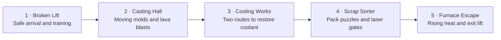

# Level 2 — The Furnace Below

Status: implemented as `dist/level2.html`. This document remains the route and behavior specification.
Target playtime: 15–20 minutes.

Bix and Pack descend beneath the factory to repair the cooling system. Their repair accidentally wakes the automated furnace supervisor, which mistakes them for scrap metal.

Art direction: follow `design/ART-DIRECTION.md`: the approved Bix/Pack industrial world, with brighter molten metal, deep shadows, worn machinery, and clear platform edges.

## Route

| Area | Visual layout | Gameplay | Time |
|---|---|---|---|
| 1 · Broken Lift | A ruined lift lands on a wide platform; short descending ledges lead into the furnace | Safe introduction to timed vents and hanging | 2 min |
| 2 · Casting Hall | Three lanes: hanging rails above, moving casting molds in the middle, molten channels below | Ride molds, jump between safe islands, watch blast warnings | 3–4 min |
| 3 · Cooling Works | A central pump room branches into an upper pipe route and a lower maintenance route | Activate two coolant valves; either route first | 4–5 min |
| 4 · Scrap Sorter | Conveyor belts pass through clearly marked laser gates; Pack has a nearby service tunnel | Bix positions a battery while Pack opens machinery | 3–4 min |
| 5 · Furnace Escape | A vertical chamber with staggered platforms and an emergency lift at the top | Climb above rising heat, with safe resting ledges | 3–5 min |

## Enemies

Bix is a repair technician, not a fighter. There is no weapon and no health bar, the same as Level 1. Every enemy is a hazard with a readable rhythm: learn the cycle, use the environment, or spend Pack.

| Enemy | Where | Behaviour | How to beat it |
|---|---|---|---|
| **Scrap Crawler** | Casting Hall, Scrap Sorter | Four-legged salvage drone. Patrols a fixed span, turns at the edge and pauses 0.6 s. Contact means it grabs Bix as scrap. | Pass behind it during the turn pause, ride a mold past it, or spend a Pack ping. |
| **Slag Spitter** | Cooling Works | Wall turret. Amber eye for 0.8 s, then a molten arc along a fixed parabola every 2.6 s. The arc always lands in the same place. | Learn the landing spot and cross on the cooldown, or have Pack shut the port it fires through. |
| **Sorter Claw** | Scrap Sorter | Ceiling claw on a rail, the supervisor's arm. Picks Bix's belt lane, commits, then slams. Cycle 3.8 s: track 1.4, lock 0.4, slam 0.6, retract 1.4. | Watch which lane it locks, then change lanes. It cannot correct once it commits. |
| **Cinder Wasp** | Furnace Escape | Ember drone that rises out of a vent and drifts toward Bix. Slow, but it never stops, so resting costs you. | Keep climbing. An open shutter's coolant mist clears every wasp near it. |
| **The Supervisor** | Scrap Sorter cameo, Furnace Escape | The furnace supervisor's head unit on a gantry. Never a fight: it sweeps a classification beam across the climb. | Stay out of the beam. It stalls 2 s each time a cooling shutter opens; that is the window. |

Rules for enemies:

- Each enemy appears once on its own, on flat ground with no second hazard, before it is ever combined with blasts, lasers or a moving platform.
- No off-screen damage, no instant kill without a tell, no chasing through a checkpoint.
- Every enemy telegraphs on the machine itself, the same way blasts and lasers already do.
- The Broken Lift stays safe. Its Crawler is sealed behind glass, so the player learns the silhouette and the sound before it can matter.

## New mechanic: Pack Assist

At marked terminals, ACT sends Pack to operate a nearby mechanism. Bix remains the playable character. Pack's destination and the affected platform light up so the result is clear.

## Pack's role (the backpack robot)

Pack is more than a companion: each area gives him a job that changes how the level is played.

| Pack's role | How it works | Where used |
|---|---|---|
| Scan hazards | His eye turns amber before a blast; a small light marks the danger | Casting Hall |
| Operate machinery | Tap ACT near a terminal; Pack extends an arm to open gates or move platforms | Cooling Works |
| Carry a power cell | Bix collects a cell, Pack stores it, then installs it at a marked socket | Scrap Sorter |
| Ping an enemy | ACT near a marked enemy sends Pack to EMP it, stunning it about 2 s | Casting Hall onward |
| Emergency catch | Pack catches Bix after a missed jump and returns him to the last safe platform | Throughout |
| Hold the exit open | Pack holds a failing shutter while Bix reaches the override, then flies back to him | Furnace Escape |

Two visual modes:

- **Travelling:** attached to Bix's back.
- **Assisting:** hovering beside machinery.

Show the transition between modes, moving arms, eye reactions and a visible power cell.

Mobile controls stay simple: one ACT button with a short context label such as "Scan", "Connect", "Open" or "Ping" when relevant.

### One resource, two uses

Pack holds **one charge** and recharges at every checkpoint. The player spends it either to **ping** an enemy or to keep it in reserve for the **emergency catch** after a missed jump. They cannot have both. This is the main source of added tension: the safety net and the offensive option are the same resource.

These abilities and animations are implemented in Level 2 and do not alter Level 1.

## Difficulty pass

Level 2 is meant to be harder than Level 1. The increase comes from combining hazards and adding pressure, never from removing checkpoints or hiding information.

| Area | Difficulty | What makes it harder |
|---|---|---|
| 1 · Broken Lift | 1 / 5 | Nothing. The teaching area stays safe on purpose. |
| 2 · Casting Hall | 3 / 5 | Blast interval tightens from 4.2 s to 3.4 s. Mold gaps widen. Crawlers patrol the safe islands, so an island stops being a rest. The upper rail lane gains a moving gap. |
| 3 · Cooling Works | 3 / 5 | Upper pipe segments retract under Bix. The lower tunnel floods on a timer, so the "safe" route is no longer slow and free. One Slag Spitter covers each route. |
| 4 · Scrap Sorter | 4 / 5 | Laser gates alternate in pairs, so standing still is its own mistake. Belts carry Bix toward the gates. The Sorter Claw tracks his lane, and a Crawler blocks Pack's tunnel. |
| 5 · Furnace Escape | 5 / 5 | Each shutter Bix opens makes the supervisor speed the recycling cycle, so heat climbs faster after every win. Wasps punish resting, and the classification beam sweeps the mid-climb. |

Guardrails that do not change:

- A checkpoint still comes before every major challenge, and each rest ledge in the Furnace Escape is one.
- Every required jump is still tested with mobile tap controls, at the tightened timings.
- Optional cog routes stay optional. The main route must remain readable and beatable without them.

## Final sequence

The supervisor starts a "routine recycling cycle." Bix must open three cooling shutters during the ascent, then board the lift with Pack.

## Design rules

- Checkpoint before each major challenge.
- Every required jump tested with mobile tap controls.
- Blast and laser warnings stay on the machinery.
- Dialogue stays in the compact HUD area.
- Optional cog routes add difficulty; the main route stays readable.
- Introduce each hazard safely before combining it with another.

## Dialogue

PACK: "Good news: we're recyclable."
BIX: "Find less good news."
PACK, after a rescue: "That counts as overtime."
